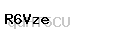
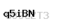

parsing-captcha-2
===========

Пример разбора простой капчи (#python #python3 #captcha #PIL #image_processing) 


##### Проверил 1000 капч и не получилось найти 7 букв: 'l', 'o', 's', 'I', 'O', '0', '1'. #####

От репозитория [parsing_captcha](https://github.com/gil9red/parsing_captcha) отличается:
- Другой вид капчи

Алгоритм такой же как и в [parsing_captcha](https://github.com/gil9red/parsing_captcha), но 100% точный из-за того, что капчи этого репозитория всегда имеют просветы между буквами.


#### Лог работы:
```
C:\Python34\pythonw.exe C:/Users/ipetrash/Desktop/PyScripts/parsing-captcha-2/main.py
Не хватает 7 букв: ['l', 'o', 's', 'I', 'O', '0', '1']

"eG9WU" -- examples\1.png
"R6Vze" -- examples\2.png
"q5iBN" -- examples\3.png
"Mp2j8" -- examples\4.png
"a7dyt" -- examples\5.png

...

"8tfhc" -- examples\99.png
"LDnRj" -- examples\100.png

Process finished with exit code 0
```

#### Пример работы парсера:
Файл         | Капча | Результат парсинга
------------ | ------------ | ------------
[examples/1.png](examples/1.png) |  | eG9WU
[examples/2.png](examples/2.png) |  | R6Vze
[examples/3.png](examples/3.png) |  | q5iBN
[examples/4.png](examples/4.png) |  | Mp2j8
[examples/5.png](examples/5.png) |  | a7dyt
[examples/6.png](examples/6.png) |  | mXdk9
[examples/7.png](examples/7.png) |  | 9wViW
[examples/8.png](examples/8.png) |  | vSpRE
[examples/9.png](examples/9.png) |  | EJX9r
[examples/10.png](examples/10.png) |  | CtkB7

#### Мои репозитории с парсерами капчи:
* https://github.com/gil9red/parser-phone-image
* https://github.com/gil9red/parsing_captcha
* https://github.com/gil9red/parsing-captcha-2
* https://github.com/gil9red/parsing-captcha-3
* https://github.com/gil9red/hideme.ru-proxy-list
